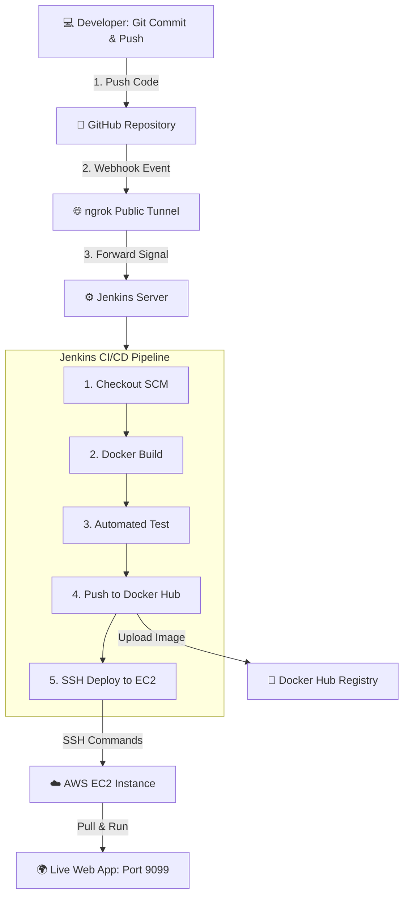

# 📖 ឯកសារណែនាំពេញលេញ៖ ការបង្កើតប្រព័ន្ធ CI/CD Automation ជាមួយ Jenkins, GitHub, Docker Hub & AWS EC2

> **មុខវិជ្ជា**: Cloud Technology / DevOps Engineering  
> **អ្នករៀបចំ**: Tonn Sievphor (`@phor2026`)  
> **ភាសាគាំទ្រ**: HTML (Nginx), PHP (Apache), Python (Flask)

---

## 📑 មាតិកា (Table of Contents)
1. [ស្ថាបត្យកម្មទូទៅនៃប្រព័ន្ធ CI/CD (System Architecture)](#១-ស្ថាបត្យកម្មទូទៅនៃប្រព័ន្ធ-cicd)
2. [ការដំឡើង និងដំណើរការ Jenkins លើ Docker](#២-ការដំឡើង-និងដំណើរការ-jenkins-លើ-docker)
3. [ការភ្ជាប់ GitHub Webhook ជាមួយ Jenkins (តាមរយៈ ngrok)](#៣-ការភ្ជាប់-github-webhook-ជាមួយ-jenkins)
4. [ការកំណត់ Credentials ក្នុង Jenkins](#៤-ការកំណត់-credentials-ក្នុង-jenkins)
5. [កំណែទី ១៖ គម្រោង HTML / Static Web (Nginx)](#៥-កំណែទី-១-គម្រោង-html--static-web-nginx)
6. [កំណែទី ២៖ គម្រោង PHP Web Application (Apache + PHP 8.2)](#៦-កំណែទី-២-គម្រោង-php-web-application)
7. [កំណែទី ៣៖ គម្រោង Python Web Application (Flask)](#៧-កំណែទី-៣-គម្រោង-python-web-application)
8. [ការ Deploy ទៅកាន់ AWS EC2 តាមរយៈ SSH](#៨-ការ-deploy-ទៅកាន់-aws-ec2-តាមរយៈ-ssh)
9. [បញ្ហាដែលតែងជួបប្រទះ និងដំណោះស្រាយ (Troubleshooting)](#៩-បញ្ហាដែលតែងជួបប្រទះ-និងដំណោះស្រាយ)

---

## ១. ស្ថាបត្យកម្មទូទៅនៃប្រព័ន្ធ CI/CD



---

## ២. ការដំឡើង និងដំណើរការ Jenkins លើ Docker

ដើម្បីឱ្យ Jenkins អាចប្រើប្រាស់ Docker Commands (`docker build`, `docker push`, `docker run`) បាន យើងត្រូវ Run Jenkins Container ដោយភ្ជាប់ជាមួយ **Docker Socket (`/var/run/docker.sock`)**៖

```powershell
# 1. ដំណើរការ Jenkins Container
docker run -d `
  --name jenkins `
  -p 8080:8080 `
  -p 50000:50000 `
  -u root `
  -v jenkins_home:/var/jenkins_home `
  -v //var/run/docker.sock:/var/run/docker.sock `
  --restart=on-failure `
  jenkins/jenkins:lts

# 2. ដំឡើង Docker CLI ក្នុង Jenkins Container
docker exec jenkins bash -c "curl -fsSL https://download.docker.com/linux/static/stable/x86_64/docker-27.3.1.tgz | tar -xz -C /tmp && mv /tmp/docker/docker /usr/local/bin/ && rm -rf /tmp/docker"

# 3. យក Initial Admin Password សម្រាប់ Unlock Jenkins
docker exec jenkins cat /var/jenkins_home/secrets/initialAdminPassword
```

* បើក Browser ចូលទៅកាន់ **`http://localhost:8080`** រួចបញ្ចូល Password និងជ្រើសរើស **Install suggested plugins**។

---

## ៣. ការភ្ជាប់ GitHub Webhook ជាមួយ Jenkins

ដោយសារ Jenkins ដំណើរការលើម៉ាស៊ីនផ្ទាល់ខ្លួន (`localhost:8080`) យើងត្រូវប្រើ **ngrok** ដើម្បីបង្កើត Public URL៖

1. **ដំណើរការ ngrok លើ PowerShell:**
   ```powershell
   ngrok http 8080
   ```
   *(អ្នកនឹងទទួលបាន Link មួយ ឧ. `https://xxxx.ngrok-free.app`)*

2. **កំណត់លើ GitHub Repository:**
   * ចូល GitHub Repo ➔ **Settings** ➔ **Webhooks** ➔ **Add webhook**
   * **Payload URL**: `https://xxxx.ngrok-free.app/github-webhook/` *(កុំភ្លេចសញ្ញា `/` នៅខាងចុង)*
   * **Content type**: `application/json`
   * **Events**: `Just the push event`
   * ចុច **Add webhook** (នឹងចេញសញ្ញា 🟢)

---

## ៤. ការកំណត់ Credentials ក្នុង Jenkins

ចូលទៅកាន់ **Manage Jenkins** ➔ **Credentials** ➔ **System** ➔ **Global credentials** ➔ **Add Credentials**៖

### ក. Docker Hub Credential (សម្រាប់ Push Images)
* **Kind**: `Username with password`
* **Username**: `phor2026` (ឈ្មោះគណនី Docker Hub របស់អ្នក)
* **Password**: Password ឬ Personal Access Token របស់ Docker Hub
* **ID**: `docker-hub-credentials`

### ខ. AWS EC2 SSH Key (សម្រាប់ Deploy ទៅ Server)
* **Kind**: `SSH Username with private key`
* **Username**: `ubuntu` (ឬ `ec2-user`)
* **ID**: `ec2-server-key`
* **Private Key**: ជ្រើសយក *Enter directly* រួច Paste មាតិកាទាំងអស់នៃ file `.pem` របស់អ្នកចូល។

---

## ៥. កំណែទី ១៖ គម្រោង HTML / Static Web (Nginx)

### ក. File `Dockerfile` (HTML Version)
```dockerfile
FROM nginx:alpine
COPY . /usr/share/nginx/html/
EXPOSE 80
CMD ["nginx", "-g", "daemon off;"]
```

### ខ. File `Jenkinsfile` (HTML Version)
```groovy
pipeline {
    agent any
    environment {
        DOCKER_HUB_USER = 'phor2026'
        IMAGE_NAME      = 'jenkins-demo-app'
        EC2_IP          = '3.107.9.73'
        EC2_USER        = 'ubuntu'
        APP_PORT        = '9099'
    }
    stages {
        stage('1. Checkout Code') {
            steps { checkout scm }
        }
        stage('2. Build Docker Image') {
            steps {
                sh "docker build -t ${DOCKER_HUB_USER}/${IMAGE_NAME}:latest -t ${DOCKER_HUB_USER}/${IMAGE_NAME}:${BUILD_NUMBER} ."
            }
        }
        stage('3. Test Nginx Config') {
            steps {
                sh "docker run --rm --entrypoint nginx ${DOCKER_HUB_USER}/${IMAGE_NAME}:latest -t"
            }
        }
        stage('4. Push to Docker Hub') {
            steps {
                withCredentials([usernamePassword(credentialsId: 'docker-hub-credentials', usernameVariable: 'DH_USER', passwordVariable: 'DH_PASS')]) {
                    sh 'echo "$DH_PASS" | docker login -u "$DH_USER" --password-stdin'
                    sh "docker push ${DOCKER_HUB_USER}/${IMAGE_NAME}:${BUILD_NUMBER}"
                    sh "docker push ${DOCKER_HUB_USER}/${IMAGE_NAME}:latest"
                }
            }
        }
        stage('5. Deploy to AWS EC2') {
            steps {
                sshagent(['ec2-server-key']) {
                    sh """
                        ssh -o StrictHostKeyChecking=no ${EC2_USER}@${EC2_IP} "
                            docker pull ${DOCKER_HUB_USER}/${IMAGE_NAME}:latest && \\
                            docker stop ${IMAGE_NAME} || true && \\
                            docker rm ${IMAGE_NAME} || true && \\
                            docker run -d --name ${IMAGE_NAME} -p ${APP_PORT}:80 ${DOCKER_HUB_USER}/${IMAGE_NAME}:latest
                        "
                    """
                }
            }
        }
    }
}
```

---

## ៦. កំណែទី ២៖ គម្រោង PHP Web Application (Apache + PHP 8.2)

### ក. File `index.php`
```php
<?php
    $developer = "Tonn Sievphor";
    $server_time = date('Y-m-d H:i:s T');
    $php_version = phpversion();
?>
<!DOCTYPE html>
<html>
<head>
    <title>PHP CI/CD - AWS EC2</title>
</head>
<body style="font-family: sans-serif; text-align: center; padding: 50px;">
    <h1>🐘 Hello from PHP Application!</h1>
    <p>Developer: <strong><?php echo $developer; ?></strong></p>
    <p>PHP Version: <strong><?php echo $php_version; ?></strong></p>
    <p>Server Time: <strong><?php echo $server_time; ?></strong></p>
</body>
</html>
```

### ខ. File `Dockerfile` (PHP Version)
```dockerfile
FROM php:8.2-apache
COPY . /var/www/html/
EXPOSE 80
```

### គ. File `Jenkinsfile` (PHP Version)
* ត្រង់ **Stage Test** ប្តូរទៅជា៖
```groovy
stage('3. Test PHP Syntax') {
    steps {
        echo "🧪 Checking PHP syntax..."
        sh "docker run --rm --entrypoint php ${DOCKER_HUB_USER}/${IMAGE_NAME}:latest -l /var/www/html/index.php"
        echo "✅ PHP Syntax is 100% valid!"
    }
}
```

---

## ៧. កំណែទី ៣៖ គម្រោង Python Web Application (Flask)

### ក. File `app.py`
```python
from flask import Flask, jsonify
import datetime
import os

app = Flask(__name__)

@app.route('/')
def home():
    return jsonify({
        "status": "success",
        "message": "🐍 Hello from Python Flask API on AWS EC2!",
        "developer": "Tonn Sievphor",
        "server_time": str(datetime.datetime.now()),
        "environment": "Production - CI/CD Automated"
    })

@app.route('/health')
def health():
    return jsonify({"status": "healthy"}), 200

if __name__ == '__main__':
    app.run(host='0.0.0.0', port=5000)
```

### ខ. File `requirements.txt`
```text
flask==3.0.3
gunicorn==22.0.0
pytest==8.2.0
```

### គ. File `Dockerfile` (Python Version)
```dockerfile
FROM python:3.11-slim
WORKDIR /app
COPY requirements.txt .
RUN pip install --no-cache-dir -r requirements.txt
COPY . .
EXPOSE 5000
CMD ["gunicorn", "--bind", "0.0.0.0:5000", "app:app"]
```

### ឃ. File `Jenkinsfile` (Python Version)
```groovy
pipeline {
    agent any
    environment {
        DOCKER_HUB_USER = 'phor2026'
        IMAGE_NAME      = 'python-demo-app'
        EC2_IP          = '3.107.9.73'
        EC2_USER        = 'ubuntu'
        APP_PORT        = '9099'
    }
    stages {
        stage('1. Checkout Code') {
            steps { checkout scm }
        }
        stage('2. Build Python Docker Image') {
            steps {
                sh "docker build -t ${DOCKER_HUB_USER}/${IMAGE_NAME}:latest -t ${DOCKER_HUB_USER}/${IMAGE_NAME}:${BUILD_NUMBER} ."
            }
        }
        stage('3. Test Python Syntax & Health') {
            steps {
                echo "🧪 Testing Python Syntax..."
                sh "docker run --rm --entrypoint python ${DOCKER_HUB_USER}/${IMAGE_NAME}:latest -c 'import app; print(\"App imported successfully!\")'"
            }
        }
        stage('4. Push to Docker Hub') {
            steps {
                withCredentials([usernamePassword(credentialsId: 'docker-hub-credentials', usernameVariable: 'DH_USER', passwordVariable: 'DH_PASS')]) {
                    sh 'echo "$DH_PASS" | docker login -u "$DH_USER" --password-stdin'
                    sh "docker push ${DOCKER_HUB_USER}/${IMAGE_NAME}:${BUILD_NUMBER}"
                    sh "docker push ${DOCKER_HUB_USER}/${IMAGE_NAME}:latest"
                }
            }
        }
        stage('5. Deploy to AWS EC2') {
            steps {
                sshagent(['ec2-server-key']) {
                    sh """
                        ssh -o StrictHostKeyChecking=no ${EC2_USER}@${EC2_IP} "
                            docker pull ${DOCKER_HUB_USER}/${IMAGE_NAME}:latest && \\
                            docker stop ${IMAGE_NAME} || true && \\
                            docker rm ${IMAGE_NAME} || true && \\
                            docker run -d --name ${IMAGE_NAME} -p ${APP_PORT}:5000 ${DOCKER_HUB_USER}/${IMAGE_NAME}:latest
                        "
                    """
                }
            }
        }
    }
}
```

---

## ៨. ការ Deploy ទៅកាន់ AWS EC2 តាមរយៈ SSH

1. **ការរៀបចំលើ AWS Management Console:**
   * បង្កើត EC2 Instance (Ubuntu 22.04 ឬ 24.04 LTS)
   * ចូលទៅ **Security Groups** ➔ **Inbound Rules** ➔ បើក Port៖
     * **Port `22` (SSH)** ➔ Source: `0.0.0.0/0`
     * **Port `9099` (Custom TCP)** ➔ Source: `0.0.0.0/0`
2. **ការរៀបចំ Docker លើ EC2:**
   ```bash
   sudo apt update && sudo apt install -y docker.io
   sudo usermod -aG docker ubuntu
   ```
3. **ការចូលមើល Web App លើ Browser:**
   👉 **`http://3.107.9.73:9099`**

---

## ៩. បញ្ហាដែលតែងជួបប្រទះ និងដំណោះស្រាយ (Troubleshooting)

| បញ្ហា (Issues) | មូលហេតុ (Root Causes) | ដំណោះស្រាយ (Solutions) |
| :--- | :--- | :--- |
| **`fatal: not in a git directory`** | Jenkins ប្រើ "Lightweight checkout" | ចូល Job Config ➔ បិទ (Uncheck) **Lightweight checkout** |
| **`Could not find credentials entry with ID`** | មិនទាន់បាន Add Credential ក្នុង Jenkins | ចូល `Manage Jenkins` ➔ `Credentials` រួចបង្កើត ID ឱ្យដូចក្នុង `Jenkinsfile` |
| **`localhost refused to connect`** | Container មិនបាន Map Port `8080` ទៅ Host | Run Docker ដោយដាក់ parameter `-p 8080:8080` |
| **`docker: command not found in Jenkins`** | Jenkins container គ្មាន Docker CLI | Install static binary `docker` ចូលក្នុង `/usr/local/bin/` នៃ container |
| **`EC2 Site can't be reached (Timeout)`** | Security Group មិនទាន់បើក Port 9099 | ចូល AWS EC2 Console ➔ Add Inbound Rule Port `9099` (0.0.0.0/0) |

---
**រៀបចំដោយក្តីគោរព និងស្រឡាញ់បច្ចេកវិទ្យា Cloud!** 🚀
